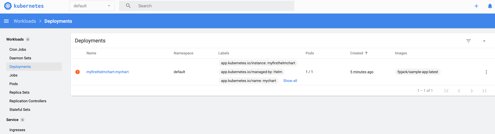
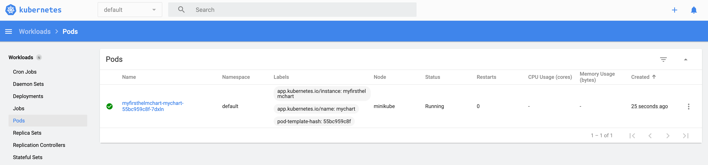
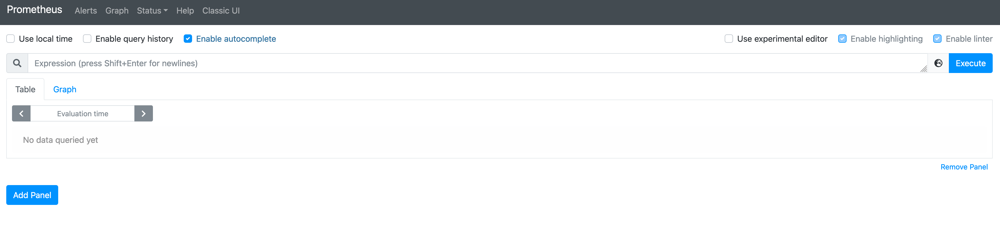
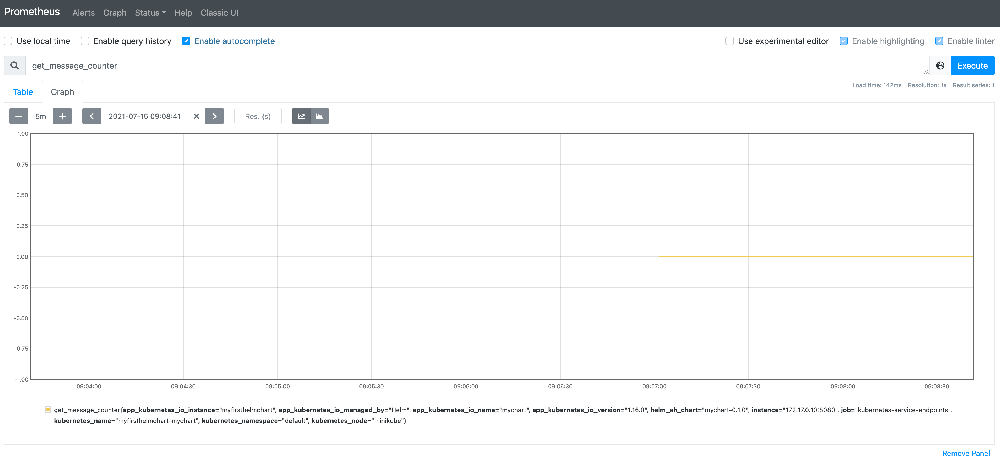

# k8-demo-2

For this tutorial we are going to be looking primarily around Helm and how it relates to installing software into your
Kubernets cluster.

#### Helm

So what is Helm? Helm is the first application package manager running atop Kubernetes. 
It allows describing the application structure through convenient helm-charts and managing it 
with simple commands.

For the CentOS users amongst you, Helm is to Kubernetes as Yum is to CentOS. Ish.

It actually also provides us with a lot of flexibility and templating around our installations of software
as it provides its own templating language and supporting mechanics that allow us to make significant changes
to our installation without having to make major alterations to the `deployment` manifests.

#### Installing Helm

Helm 3 (the most recent version) just relies on a local installation of the Helm binary in terms of installation.
Older versions had a server (tiller) and client (helm) combination of tool that made it somewhat more cumbersome to use.

On MacOS, the easiest way to get Helm is simply:

```bash
brew install helm
```

Alternatively, you can download the binary from [here](https://github.com/helm/helm/releases) and simply untar the executable, e.g.

```bash
tar -zxvf helm-v3.6.2-darwin-amd64.tar.gz
cd darwin-amd64/
./helm
```

More instructions can also be found [here](https://helm.sh/docs/intro/install/) should neither be suitable options.

#### Creating our first Helm chart deployment

So, in our first tutorial we deployed the following to our cluster via a Kubernetes manifest:

```yaml
apiVersion: v1
kind: Pod
metadata:
  name: single-pod
  labels:
    role: myrole
spec:
  containers:
    - name: server
      image: fpjack/sample-app
      ports:
        - name: web
          containerPort: 8080
          protocol: TCP
```

This is a fairly simple deployment and is probably sufficient for this type of application. But suppose we wanted
to deploy this via Helm, perhaps so we could [publish the chart](https://helm.sh/docs/topics/chart_repository/)
and allow other users to simply install our application (as well as perhaps tweak certain aspects of the install).

We can create our chart using Helms built in generator:

```bash
helm create mychart
```

Helm will create a new directory in your project called mychart with the structure shown below.
Let's navigate our new chart to find out how it works.

```yaml
mychart/
├── Chart.yaml
├── charts
├── templates
│   ├── NOTES.txt
│   ├── _helpers.tpl
│   ├── deployment.yaml
│   ├── hpa.yaml
│   ├── ingress.yaml
│   ├── service.yaml
│   ├── serviceaccount.yaml
│   └── tests
│       └── test-connection.yaml
└── values.yaml
```

So, there is a lot of boiler plate that we don't care about installed here. For now, we are going to ignore most of this
and focus on just the `deployment.yaml` and `values.yaml` file.

First, update the `values.yaml` file so it now reads:

```yaml
...
image:
  repository: fpjack/sample-app
  pullPolicy: IfNotPresent
  # Overrides the image tag whose default is the chart appVersion.
  tag: "latest"
...
```

This is the image we used in the first tutorial. Now, if we run:

```bash
helm myfirsthelmchart mychart
```

We should get some output:

```bash
NAME: myfirsthelmchart
LAST DEPLOYED: Wed Jul 14 15:31:47 2021
NAMESPACE: default
STATUS: deployed
REVISION: 1
NOTES:
1. Get the application URL by running these commands:
  export POD_NAME=$(kubectl get pods --namespace default -l "app.kubernetes.io/name=mychart,app.kubernetes.io/instance=myfirsthelmchart" -o jsonpath="{.items[0].metadata.name}")
  export CONTAINER_PORT=$(kubectl get pod --namespace default $POD_NAME -o jsonpath="{.spec.containers[0].ports[0].containerPort}")
  echo "Visit http://127.0.0.1:8080 to use your application"
  kubectl --namespace default port-forward $POD_NAME 8080:$CONTAINER_PORT
```

To check if the chart is installed, run `helm ls`:

```bash
Andrews-MBP:k8s-demo-2 andrew$ helm ls
NAME            	NAMESPACE	REVISION	UPDATED                             	STATUS  	CHART        	APP VERSION
myfirsthelmchart	default  	1       	2021-07-14 15:31:47.400373 +0100 BST	deployed	mychart-0.1.0	1.16.0     
```

If we navigate to the dashboard, we can see that the application is installed and running:



Or not.

Well, lets see what's actually going on then! Clicking on the error icon we see:


As we mentioned above, there is A LOT of boilerplate in here. Including the `liveness` and `readiness` probes. These
are ways in which we can tell Kubernetes our services are "ready" to be used:

```yaml
livenessProbe:
httpGet:
  path: /
  port: http
readinessProbe:
httpGet:
  path: /
  port: http
```

The thing is, they require us to implement some behaviours in our application to support this. Which ours does not. 

So, lets just remove those offending lines from our `deployment.yaml` and correct the port:

```yaml
ports:
- name: http
  containerPort: 8080
  protocol: TCP
```

Then re-install our chart:

```bash
helm delete myfirsthelmchart ; helm install myfirsthelmchart mychart
```

Now we get:



Yay, it worked (if things have not gone so well for you, the version checked into this repo includes all of the 
above modifications).

You can also see the services has been included as part of the installation (similar to the last tutorial):

```bash
$ kubectl get services -n default
NAME                       TYPE        CLUSTER-IP      EXTERNAL-IP   PORT(S)   AGE
kubernetes                 ClusterIP   10.96.0.1       <none>        443/TCP   4h58m
myfirsthelmchart-mychart   ClusterIP   10.102.231.92   <none>        80/TCP    3m3s
```

###### Point of interest

The `pullPolicy: IfNotPresent` seen in the `values.yaml` is a subtle but interesting property. The `pullPolicy` 
determines whether a container is re-pulled if it is present on the node. This can have implications during development
where multiple versions of the same container are released but due to this setting not updated in the cluster.

If you find yourself in this position, changing the setting to `always` can "fix" the issue.

#### Prometheus

One of the benefits of using Helm is that we can take "off-the-shelf" charts and use them in our cluster
with fairly minimal effort. Take for example [Prometheus](https://prometheus.io/), if we wanted to install this
into our cluster we can use a published chart to quickly and easily add it to our cluster:

```bash
helm repo add stable https://kubernetes-charts.storage.googleapis.com
helm repo update
helm search repo prom
NAME                                              	CHART VERSION	APP VERSION	DESCRIPTION                                       
prometheus-community/kube-prometheus-stack        	16.13.0      	0.48.1     	kube-prometheus-stack collects Kubernetes manif...
prometheus-community/prometheus                   	14.4.0       	2.26.0     	Prometheus is a monitoring system and time seri...
prometheus-community/prometheus-adapter           	2.15.0       	v0.8.4     	A Helm chart for k8s prometheus adapter           
prometheus-community/prometheus-blackbox-exporter 	4.15.0       	0.19.0     	Prometheus Blackbox Exporter                      
...                   
prometheus-community/alertmanager                 	0.12.1       	v0.22.1    	The Alertmanager handles alerts sent by client ...
prometheus-community/kube-state-metrics           	3.4.0        	2.1.0      	Install kube-state-metrics to generate and expo...
```

The first command above highlights a common practise whereby non-dev repositories are labeled `stable`. This could
easily be any name we choose.

If we then run:

```bash
helm install myprometheus prometheus-community/prometheus
```

We should see:

```bash
NAME: myprometheus
LAST DEPLOYED: Thu Jul 15 09:49:58 2021
NAMESPACE: default
STATUS: deployed
REVISION: 1
TEST SUITE: None
NOTES:
The Prometheus server can be accessed via port 80 on the following DNS name from within your cluster:
myprometheus-server.default.svc.cluster.local


Get the Prometheus server URL by running these commands in the same shell:
  export POD_NAME=$(kubectl get pods --namespace default -l "app=prometheus,component=server" -o jsonpath="{.items[0].metadata.name}")
  kubectl --namespace default port-forward $POD_NAME 9090


The Prometheus alertmanager can be accessed via port 80 on the following DNS name from within your cluster:
myprometheus-alertmanager.default.svc.cluster.local


Get the Alertmanager URL by running these commands in the same shell:
  export POD_NAME=$(kubectl get pods --namespace default -l "app=prometheus,component=alertmanager" -o jsonpath="{.items[0].metadata.name}")
  kubectl --namespace default port-forward $POD_NAME 9093
#################################################################################
######   WARNING: Pod Security Policy has been moved to a global property.  #####
######            use .Values.podSecurityPolicy.enabled with pod-based      #####
######            annotations                                               #####
######            (e.g. .Values.nodeExporter.podSecurityPolicy.annotations) #####
#################################################################################


The Prometheus PushGateway can be accessed via port 9091 on the following DNS name from within your cluster:
myprometheus-pushgateway.default.svc.cluster.local


Get the PushGateway URL by running these commands in the same shell:
  export POD_NAME=$(kubectl get pods --namespace default -l "app=prometheus,component=pushgateway" -o jsonpath="{.items[0].metadata.name}")
  kubectl --namespace default port-forward $POD_NAME 9091

For more information on running Prometheus, visit:
https://prometheus.io/
```

If we execute the suggested commands we should be able to view the Prometheus web GUI:

```bash
export POD_NAME=$(kubectl get pods --namespace default -l "app=prometheus,component=server" -o jsonpath="{.items[0].metadata.name}")
kubectl --namespace default port-forward $POD_NAME 9090
```



If we want to use this to capture the metrics from our application, we can take advantage of the service discovery
mechanics available to us in Kubernetes by simply annotating our `service.yaml`:

```yaml
kind: Service
metadata:
  name: {{ include "mychart.fullname" . }}
  labels:
    {{- include "mychart.labels" . | nindent 4 }}
  annotations:
    prometheus.io/scrape: 'true'
    prometheus.io/port: '8080'
```

Then re-install our chart:

```bash
helm delete myfirsthelmchart ; helm install myfirsthelmchart mychart
```

If we then port forward our service and visit the URL exposed (http://localhost:8080/)
so we can increment the metrics:

```bash
kubectl port-forward service/myfirsthelmchart-mychart 8080:80
```

We should see the metrics have been automatically scraped in Prometheus (via the service discovery mechanics):


